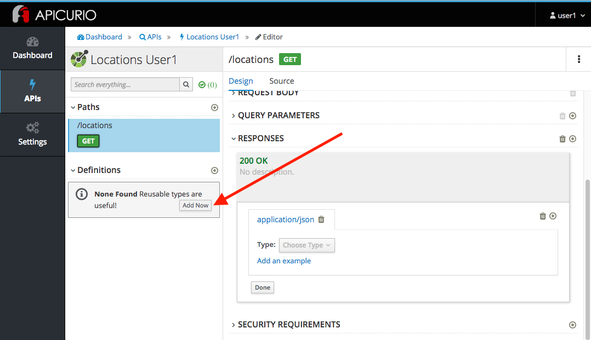
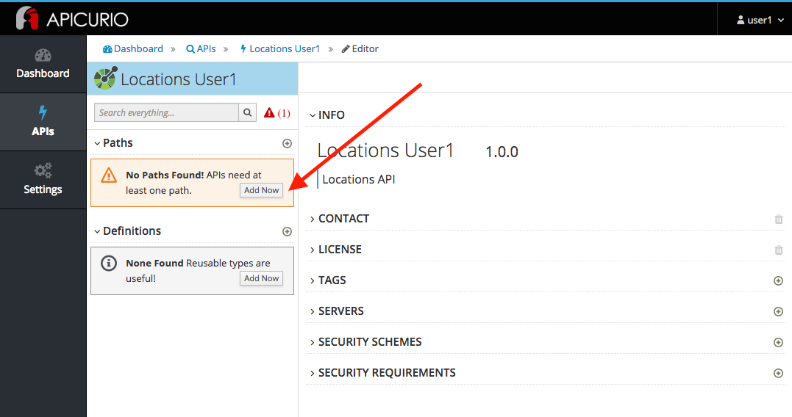
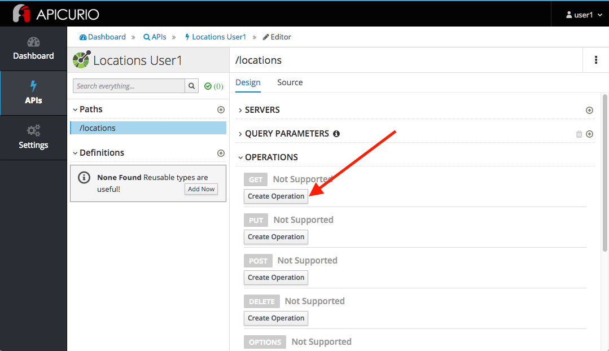
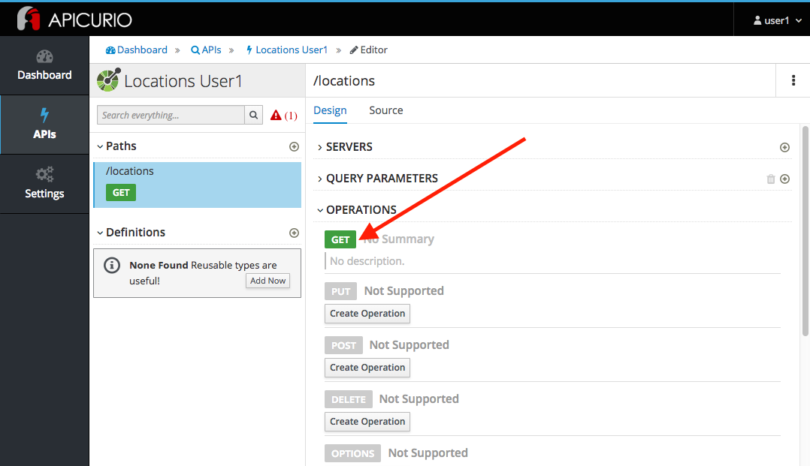
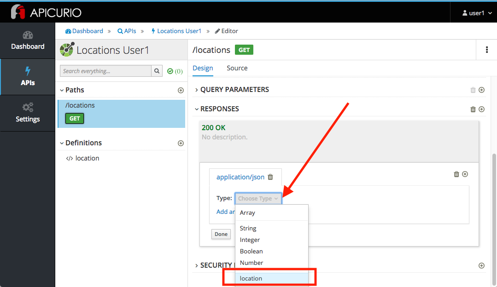

# API Design

### Create an OpenAPI Specification using Red Hat's Apicurio

* Duration: 10 mins
* Audience: API Owner, Product Manager, Developers, Architects

## Overview

> Describe the general idea of the lab and what is the attendant going to learn.

### Why Red Hat?

> Add the keypoints why the attendant will find value using Red Hat products.

### Skipping The Lab

We know sometime we don't have enough time to go over step by step on the labs. So here is a short video where you can see how to create an OpenAPI Specification with Red Hat's Apicurio. [link](wip-link)

If you are planning to skip this lab and follow the next one, here is a [link](wip-link) to the generated specification on this lab.

### Environment

**URLs:**

Check with your instruction the *GUID* number of your current workshop environment. Replace the actual number on all the URLs where you find **GUID**. 

Example in case of *GUID* = **1234**: 

```bash
https://master.GUID.openshift.opentlc.com
```

becomes =>

```bash
https://master.1234.openshift.opentlc.com
```

**Credentials:**

Your username is your asigned user number. For example, if you are assigned user number **1**, your username is: 

```bash
user1
```

The password to login is always the same:

```bash
r3dh4t1!
```

## Lab Instructions

### Step 1: Creating APIs with Apicurio Studio

1. Open a browser window and navigate to:

    ```bash
    http://apicurio-studio.apps.GUID.openshift.opentlc.com/
    ```
	
1. Log in using your designated [user and password](#environment).
	
	

1. Click on **APIs** in the left side navigation menu from the Dashboard page.

	

1. Click on **Create New API**.

	
	
1. Create a brand new API by completing the following information:

	* Type: **Open API 3.0.1**
	* Name: **Locations-UserX** (Replace *X* with your user number)
	* Description: **Locations API**

	
	
1. Click on **Create API**.

1. Finally, click on **Edit API** to start editing your newly created API.

	
	
### Step 2: Editing APIs

You are now in the main screen to edit your APIs. Different from other API editor products, Apicurio's Editor is a graphical, form-based editor. With Apicurio you don't need master in and out all the details of the **OpenAPI Specification**. It allows you to design beautiful, functionals APIs with zero coding.

Let's start crafting your API.

1. Time to prepare our data definitions for the API. Click on the **Add Now** button under the *Definitions*.

	

1. Fill in the *Name* with the **location** value. Expand the *FROM EXAMPLE (optional)* to paste the following example:

	* Name: **location**
	* FROM EXAMPLE: 

		```
		{
		    "id": 1,
		    "name": "International Inc Corporate Office",
		    "location": {
		        "lat": 51.5013673,
		        "long": -0.1440787
		    },
		    "type": "headquarter",
		    "status": "1"
		}
		```

	
	
1. Apicurio automatically trys to detect the data types from the provided example.
	
	
	
	*Time to start creating some paths*.

### Step 3: Adding Paths

1. Click on **Add Now** in the *Paths* section. As you can notice in the warning, APIs need at least one path.

	

1. Fill in the new resource path with the following information:

	* Path: **/locations**

	

1. Click **Add**.

	*By default, Apicurio suggest a series of available operations for your new path*.

1. Click **Create Operation** under the *GET* operation.

	

1. Click on the green **GET** operation button to edit the operation information.

	
	
	*As you can notice, Apicurio Editor guides you with warning for the elements missing in your design*.

1. Click on the **Add Response** button to edit the response for this operation.

	

1. Leave the **200** option selected in the  *Response Status Code* combo box and click on **Add**.

	
	
1. Scroll down to the bottom of the page. Move your mouse over the **200 OK** response to enable the options. Click on the **Edit** button to edit the response details.

	

1. Scroll down again to the bottom of the page. Click on the **Add Media Type** button to define and configure the response media type.

	

1. Leave **application/json** as the value of *Media Type*. Click the **Add** button.

	

1. Click on the *Choose Type* combo box to display the different types. Select **location** from the displayed options.

	

1. Click the **Add an example** link to add a Response Example. 

	*This will be useful to mock your API in the next lab*.

	
	
1. Fill in the information for your response example:

	* Name: **all**
	* Example:
		
		```
		[
		    {
		        "id": 1,
		        "name": "International Inc Corporate Office",
		        "location": {
		            "lat": 51.5013673,
		            "long": -0.1440787
		        },
		        "type": "headquarter",
		        "status": "1"
		    },
		    {
		        "id": 2,
		        "name": "International Inc North America",
		        "location": {
		            "lat": 40.6976701,
		            "long": -74.259876
		        },
		        "type": "office",
		        "status": "1"
		    },
		    {
		        "id": 3,
		        "name": "International Inc France",
		        "location": {
		            "lat": 48.859,
		            "long": 2.2069746
		        },
		        "type": "office",
		        "status": "1"
		    }
	]
		```

	
	
1. Click the **Add** button.

1. Click the **Done** button to finish the response editing.

	

### Step 4: Download the API definition

1. Click the **Locations-UserX** link to return to the API admin page.

	

1. To start using your new API definition, display the API menu from the kebab link. Click the **Download (YAML)** option from the menu.

	
	
1. This will start the download of your API definition file. **Save** it to your local disk drive. 

1. You can open the file with any text editor. Take a look at the source file. Everything is there.

	

*Congratulations!* You have crated your first API definition based on the OpenAPI Specification  using Red Hat's Apicurio. Don't lose track of the file, you will use this definition for your next lab.

## Steps Beyond

So, you want more? Did you notice the link **source** when editing the *Paths* or the *Definitions*? Get back to the API editor and follow the link. What do you see? Apicurio lets you follow the form-based editor or go one step beyond and also lets you direct edit the source of your API definition.

## Summary

In this lab you used Red Hat's Apicurio to create a simple API definition using the OpenAPI Specification.

> Explain what the student accomplish.

## Notes and Further Reading

* Apicurio
	* [Webpage](https://www.apicur.io)
	* [Roadmap](https://www.apicur.io/roadmap/)
* OpenAPI
	* [OpenAPI Initiative](https://www.openapis.org/)
	* [OpenAPI Specification 3.0.1](https://github.com/OAI/OpenAPI-Specification/blob/master/versions/3.0.1.md)


