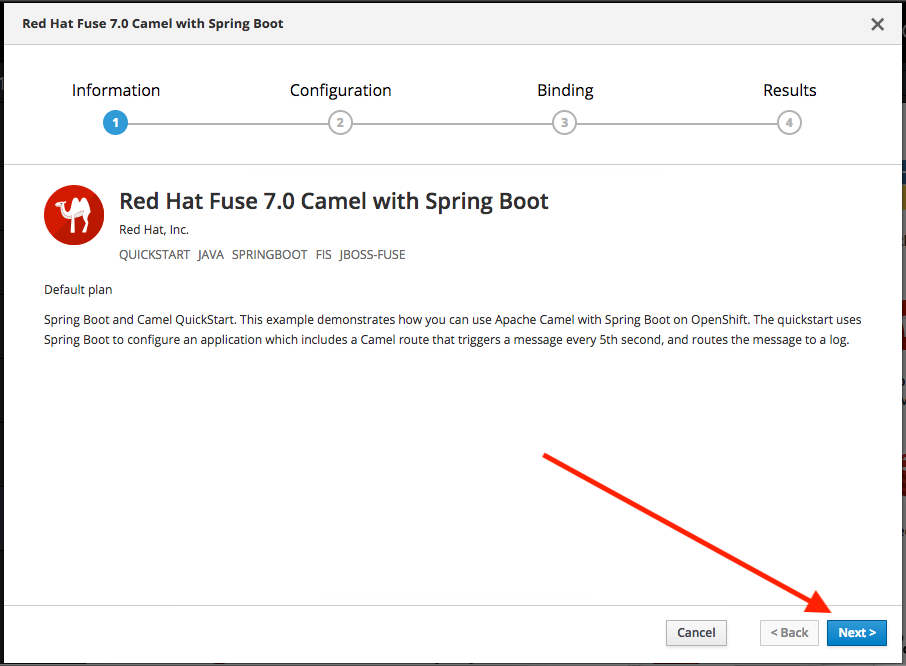
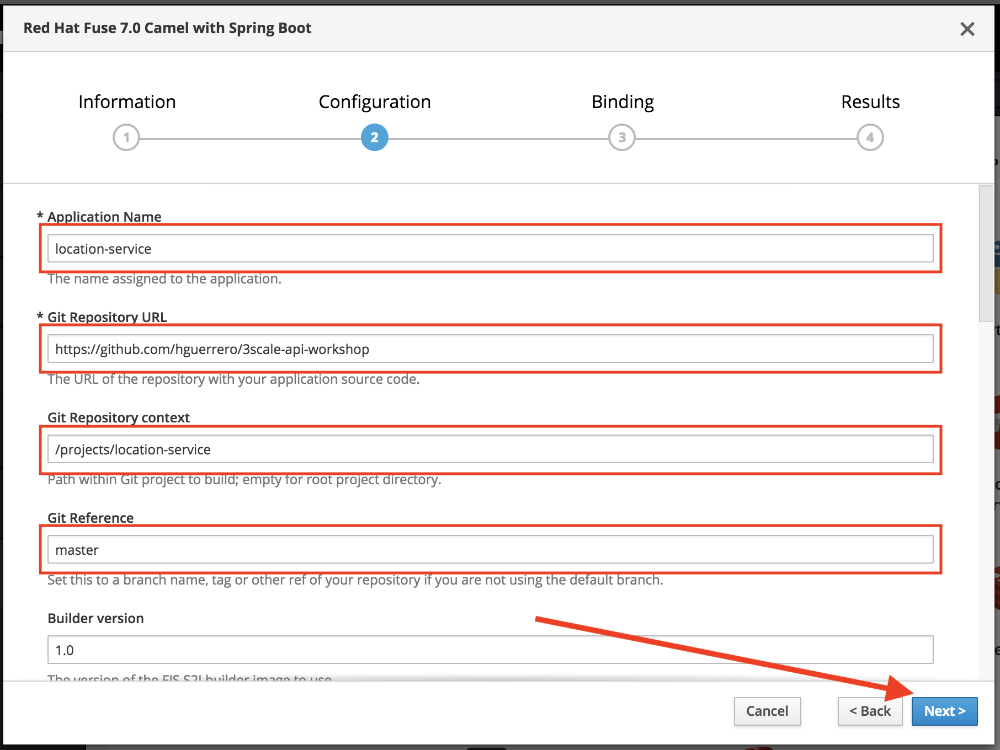
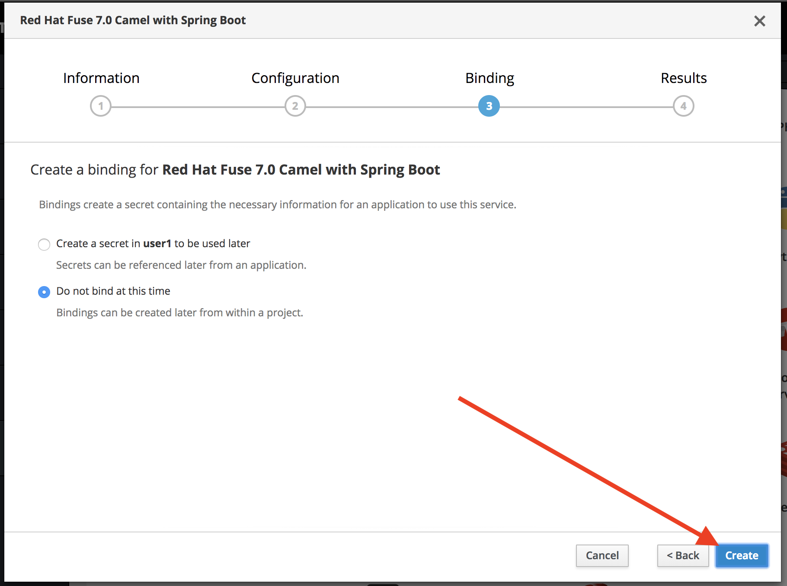
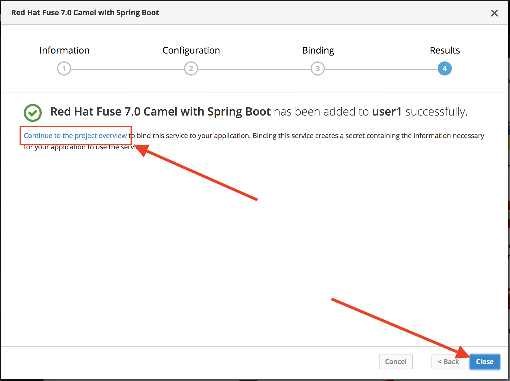
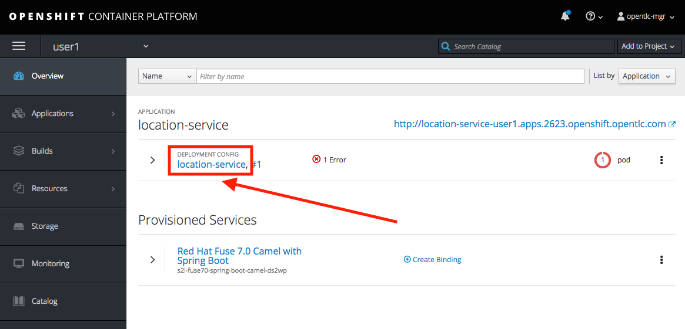
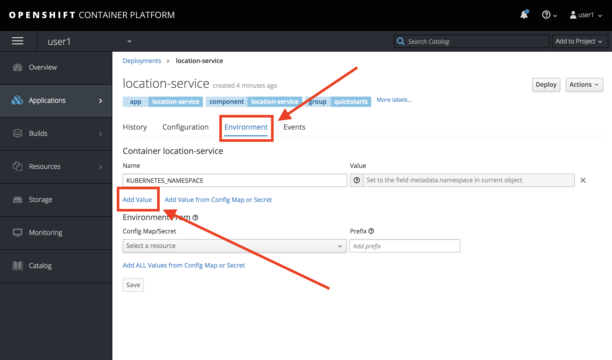
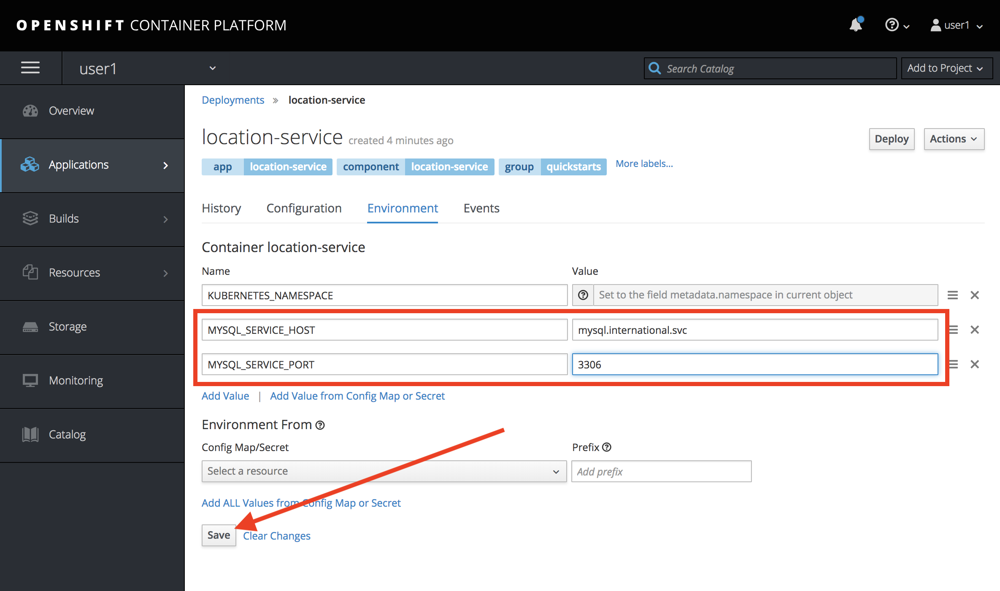
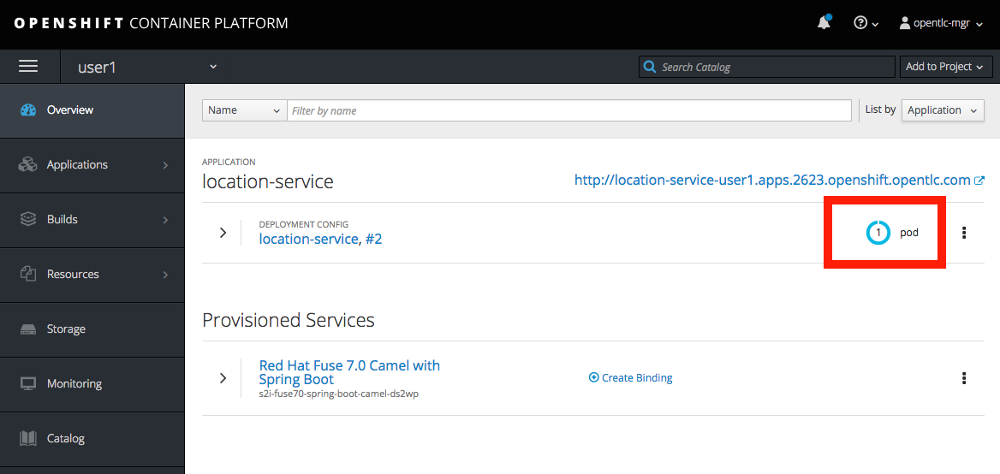
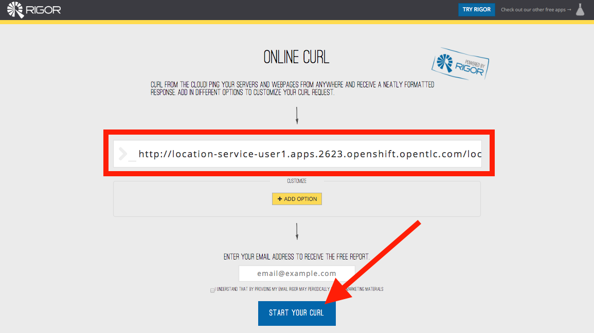
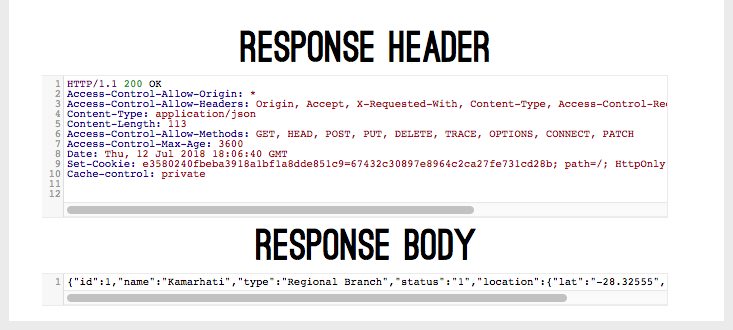

# Lab 2

## API Deployment

### Deploying APIs to OpenShift

* Duration: 15 mins
* Audience: Developers, Architects, System Administrators, Operators

## Overview

> Describe the general idea of the lab and what is the attendant going to learn.

### Why Red Hat?

> Add the keypoints why the attendant will find value using Red Hat products.

### Skipping The Lab

We know sometime we don't have enough time to go over step by step on the labs. So here is a [short video](wip-link) where you can see how to deploy a Red Hat Fuse application to OpenShift.

If you are planning to follow to the next lab, there is an already deployed and running Location API Service in this endpoint:

```bash
http://location-service-international.apps.GUID.openshiftworkshop.com
```

### Environment

**URLs:**

Check with your instruction the *GUID* number of your current workshop environment. Replace the actual number on all the URLs where you find **GUID**. 

Example in case of *GUID* = **1234**: 

```bash
https://master.GUID.openshiftworkshop.com
```

becomes =>

```bash
https://master.1234.openshiftworkshop.com
```

**Credentials:**

Your username is your asigned user number. For example, if you are assigned user number **1**, your username is: 

```bash
user1
```

The password to login is always the same:

```bash
r3dh4t1!
```

## Lab Instructions

### Step 1: Deploying Fuse-based APIs

1. Open a browser window and navigate to:

    ```bash
    https://master.GUID.openshiftworkshop.com/console
    ```

    *Remember to replace the GUID with your [environment](#environment) value and your user number.*

1. Accept the self-signed certificate if you haven't.

    

1. Log into OpenShift using your designated [user and password](#environment). Click on **Sign In**.

    

1. You are now in OpenShift's main page. Click on your **userX** project in the right side of the screen.

    

1. From your main project page, click **Browse Catalog**.

    

1. Scroll down the page and search for the **Red Hat Fuse 7.0 Camel with Spring Boot** template. Click on the link.

    

1. Click the **Next >** button.

    

1. Fill in the configuration information with your API implementation github repo details:

    * Application Name: **location-service**
    * Git Repository URL: **https://github.com/hguerrero/3scale-api-workshop**
    * Git Repository context: **/projects/location-service**
    * Git Reference: **master**

    

1. Click **Next >**.
  
1. In this moment we will not create any bindings. So click **Create**.

    

1. Your service will be provisioned in a moment. Click the **Continue to the project overview** and then click the **Close** button.

    

### Step 2: Configure External Resources

Did you notice your deployment is failing? This is because your API requires information on the database host and port to connect. Let's fix this problem.

There are several ways to provision information of the environment to your OpenShift deployment. Most of the times you will use a combination of [Config Maps](https://docs.openshift.com/container-platform/latest/dev_guide/configmaps.html), [Environment Variables](https://docs.openshift.com/container-platform/latest/dev_guide/environment_variables.html) and, [Secrets](https://docs.openshift.com/container-platform/latest/dev_guide/secrets.html). 

In this lab we will use Environment Variables.

1. From your overview page, click the **location-service** link to access the deployment configuration.

    

1. In the deployment configuration page, change to the **Environment** tab. Here click the **Add Value** link *twice* to get two (2) new rows.

    

1. Fill in with the following information regarding the location of the International Inc Database.

    * Name: **MYSQL\_SERVICE\_HOST**, Value: **mysql.international.svc**
    * Name: **MYSQL\_SERVICE\_PORT**, Value: **3306**

    

1. Click **Save** to update the configuration and redeploy the service.

1. Go back to the **Overview** page to monitor your updated deployment.

1. You should now see the blue circle in the *location-service* pod. 

    

### Step 3: Test Location API Service

We now have a working Location API Service implementation listening for requests. We will use an online cURL tool to test it.

1. Open a browser window and navigate to:

    ```bash
    https://onlinecurl.com/
    ```

1. Enter the following URL: 

    ```bash
    http://location-service-userX.apps.GUID.openshiftworkshop.com/locations/1
    ```

    Remember to replace the GUID with your [environment](#environment) values and your user number. It should look like this:

1. Click the **START YOUR CURL** button.

    

1. The page will load the response information from the service. You will be able to see the *RESPONSE HEADERS* and the actual *RESPONSE_BODY*.

    

*Congratulations!* You successfully deployed your teams Location API Service implementations into OpenShift using Red Hat Fuse 7.0 Spring Boot template.

## Steps Beyond

> So, you want more? ...

## Summary

> Explain what the student accomplish.

You can now proceed to [Lab 3](../lab03/lab03.md)

## Notes and Further Reading

* [Getting Started with OpenShift Online](https://docs.openshift.com/online/getting_started/index.html)
* [OpenShift Interactive Portal](https://learn.openshift.com/)
* [Contract First API Design with Apicurio and Fuse/Camel](http://wei-meilin.blogspot.com/2018/07/fuse-contract-first-api-design-with.html)
* [Applying API Best Practices in Fuse](http://wei-meilin.blogspot.com/2017/01/red-hat-jboss-fuse-applying-api-best.html)

> Additional links